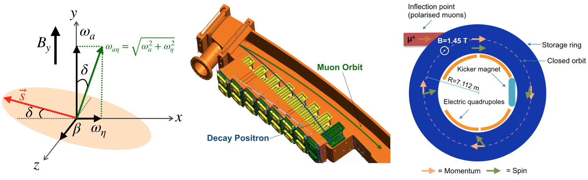
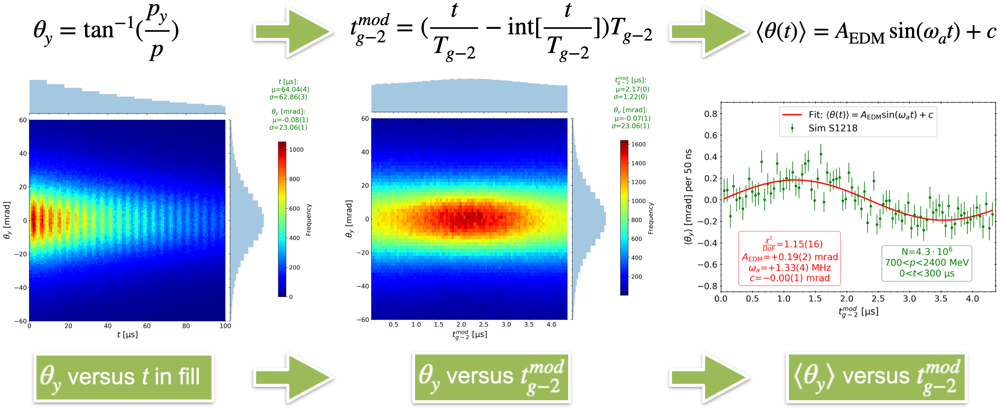
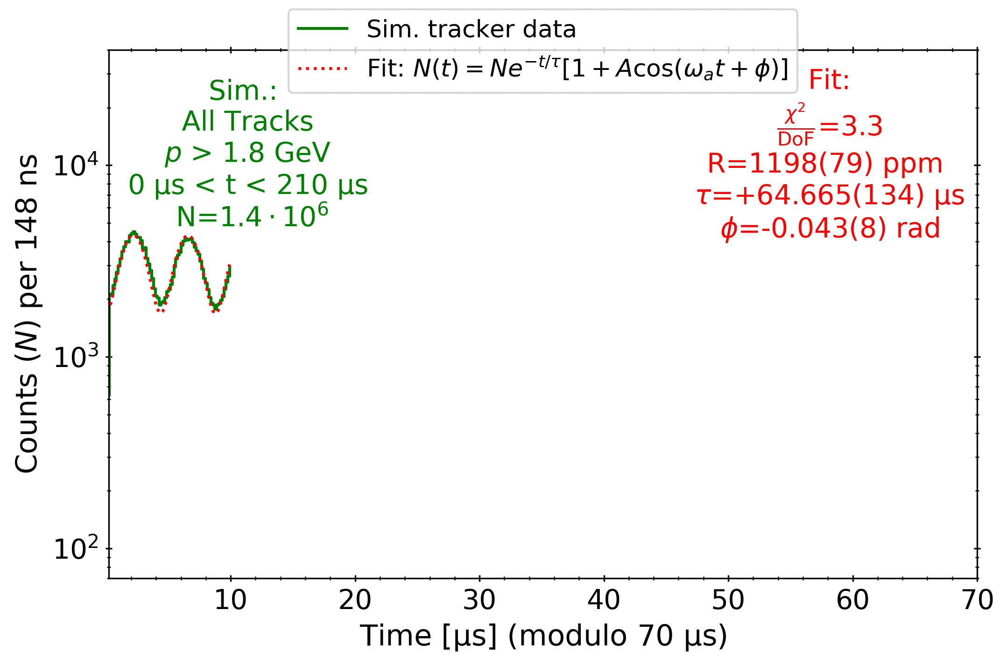

# EDMTracking

<div style="text-align:center"><a href=http://www.hep.ucl.ac.uk/~lukicov target="_blank"></a></div>

#### This project contains analysis code to place a new limit on the Electric Dipole Moment (EDM) of the muon using the g-2 tracking detectors

The g−2 experiment at Fermilab, near Chicago, is closing on a tantalising sign of New Physics (e.g. new particles or forces) - deviation between an experimentally measured and theoretically predicted value of the muon magnetic moment. There is also an additional measurement that will be made using the trackers: setting a new limit on the electric dipole moment (EDM) of the muon, which, if found to be non-zero, would provide a new source of charge-parity (CP) violation - a promising key in understanding the  matter-antimatter asymmetry of the universe!
#### Results in simulation
The EDM signal in simulation can be extracted from the fitted amplitude of the oscillation of the average (binned/profiled) vertical angle of the tracks in the detector.
<div style="text-align:center"><a href=http://www.hep.ucl.ac.uk/~lukicov target="_blank"></a></div>

The oscillation in the number of the observed tracks in the detector can be plotted and fitted 
<div style="text-align:center"><a href=http://www.hep.ucl.ac.uk/~lukicov target="_blank"></a></div>

The difference between the the observation and the fit (i.e. residuals) can also be computed, to extract even more information (i.e. missing fit parameters) from the above plot using the Fast Fourier Transform (FFT) [1] analysis (FFT converts residuals from time to frequency domain):
<div style="text-align:center"><a href=http://www.hep.ucl.ac.uk/~lukicov target="_blank"></a></div>

[1] J. Cooley and J. Tukey, Math. Comp. **19**, 297 (1965)

* **This work led to a publication (arXiv:1909.12900): <a href=https://arxiv.org/pdf/1909.12900.pdf target="_blank"> https://arxiv.org/pdf/1909.12900.pdf</a>, where EDM analysis strategy with data is discussed.**
* **The detectors were previously calibrated in https://github.com/glukicov/alignTrack**
* The analysis guide using Python and ROOT is here: https://cdcvs.fnal.gov/redmine/projects/gm2analyses/wiki/Python-based_EDM_analysis
* Example of reading tracker ROOT Trees into a pandas data frame is here: https://github.com/glukicov/EDMTracking/blob/master/JupyterNB/PYReadTree.ipynb  (quick demo on how to load, make cuts, plot data, and fit from ROOT Trees)

Project structure
============
1. Blinding/ - Blinding libraries to hide a signal in data or simulation 
2. CMacros/ - C-based analysis macros 
2. CommonUtils/ - Commonly used Python functions 
4. JupyterNB/ - Jupyter notebooks for prototyping  
5. UKGrid/ - Bash scripts to run data processing on the grid 
6. docs/ - Manuals/images/etc. 

## To get the EDM-style blinding to work in Python with the blinding libraries: 
A. Add changes to your local files from this commit: https://github.com/glukicov/EDMTracking/commit/8c1ecff08ceb905aa449d6e18a858b5ec73980b7

B. Re-compile (in the Blinders.cc directroy):
```
g++ -I rlib/include -I /usr/local/opt/openssl/include Blinders.cc -std=c++11 -Wall -Wextra -Werror -pedantic-errors -fpic -c
```
C. Now re-create a shared object library that can be used with both ROOT and Python:
```
g++ -shared -o libBlinders.so Blinders.o rlib/src/Random.o -L/usr/local/opt/openssl/lib -lssl -lcrypto
```
D. Now construct your blinder *with 4 input arguments* as follows (e.g.):
```
edmBlinded = Blinders(FitType.Omega_a, blinding_string, boxWidth, gausWidth)
```
E. Test that EDM-blinding works with
```
python3 testBlindingPy3.py
```

The official blinding guide is here: https://cdcvs.fnal.gov/redmine/projects/gm2analyses/wiki/Library_installation 

**Example of EDM Tracking art (C++) code is here https://cdcvs.fnal.gov/redmine/projects/gm2analyses/wiki/Tracker_EDM_analysis**
