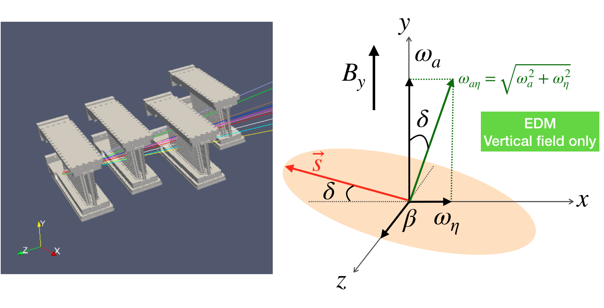

EDMTracking
======

### See here https://github.com/glukicov/EDMTracking/blob/master/JupyterNB/PYReadTree.ipynb for a quick demo on how to load, make cuts, plot data, and fit from ROOT Trees

### The analysis guide for Python is here: https://cdcvs.fnal.gov/redmine/projects/gm2analyses/wiki/Python-based_EDM_analysis

## Some common utility functions for plotting, statistics and ROOT access are in ./CommonUtils/

## To get the EDM-style blinding to work in Python with the blinding libraries: ### 
A. Add changes to your local files from this commit: https://github.com/glukicov/EDMTracking/commit/8c1ecff08ceb905aa449d6e18a858b5ec73980b7

B. Re-compile (in the Blinders.cc directroy):
```
g++ -I rlib/include -I /usr/local/opt/openssl/include Blinders.cc -std=c++11 -Wall -Wextra -Werror -pedantic-errors -fpic -c
```
C. Now re-create a shared object library that can be used with both ROOT and Python:
```
g++ -shared -o libBlinders.so Blinders.o rlib/src/Random.o -L/usr/local/opt/openssl/lib -lssl -lcrypto
```
D. Now construct your blinder *with 4 input arguments* as follows (e.g.):
```
edmBlinded = Blinders(FitType.Omega_a, blinding_string, boxWidth, gausWidth)
```
E. Test that EDM-blinding works with
```
python3 testBlindingPy3.py
```

The official blinding guide is here: https://cdcvs.fnal.gov/redmine/projects/gm2analyses/wiki/Library_installation 

Example of EDM Tracking art (C++) code is here https://cdcvs.fnal.gov/redmine/projects/gm2analyses/wiki/Tracker_EDM_analysis
